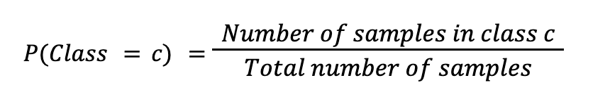
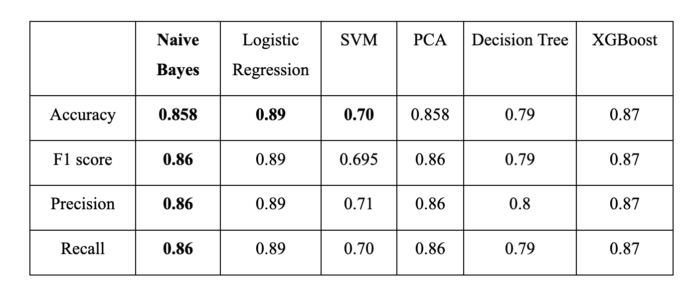
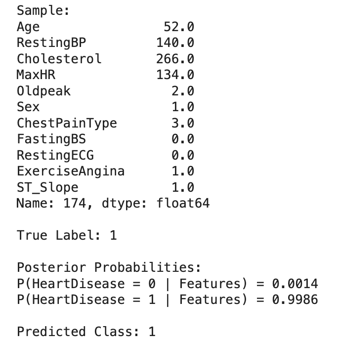

**HEART FAILURE PREDICTION**

*Vu Phuong Anh-2102176*

**Motivation**

The motivation of this homework is to apply Bayesian statisticss in building model to detect early the clinical condition of the patient's heart to avoid complications that can harm him in the future, and if he has symptoms. Simultaneously, benchmarking performance among some classification model: Naive Bayes, SVM, Decision Tree, Logistic Regression.

**Dataset**

This dataset was collected from Kaggle and created by combining different datasets already available independently but not combined before. In this dataset, 5 heart datasets are combined over 11 common features which makes it the largest heart disease dataset available so far for research purposes. The five datasets used for its curation are:

- Cleveland: 303 observations
- Hungarian: 294 observations
- Switzerland: 123 observations
- Long Beach VA: 200 observations
- Stalog (Heart) Data Set: 270 observations

Every dataset used can be found under the Index of heart disease datasets from UCI Machine Learning Repository on the following link: https://archive.ics.uci.edu/ml/machine-learning-databases/heart-disease/

**WORK FLOW**

1. Reading and understanding the data about people having sign of Cardiovascular diseases in file heart.csv and some very first line code in Homework1.ipynb.

2. Seeing the correlation matrix and distribution of 11 features denote as X and the output denote as Y which model classify a person has heart disease[1] or normal[0]. 
    
    In 11 features, there are 2 types: 

        - Categorical Features['Sex', 'ChestPainType', 'FastingBS', 'RestingECG', 'ExerciseAngina', 'ST_Slope']
   
        - Numerical Features['Age', 'RestingBP', 'Cholesterol', 'MaxHR', 'Oldpeak'].

3. Detecting outliers and removing them for better training model.

4. Calculate priors of the two labels by equation: 


5. Define functions to calculate likelihoods of numerical features (numerical_feat); categorical features(category_feat) and compute posteriors(compute_posterior) after observing priors and likelihoods. 

6. Training and testing models. 

7. Benchmarking them base on accuracy and confusion matrix.


8. Showing one example of model prediction. 


**Code Files**

- `Homework1.ipynb`: Main Colab Notebook containing all steps from preprocessing to evaluation.
- `README1.md`: Documentation file for Homework1.
- `requirements.txt`: Python dependencies.

**Installation**

1. Clone this repository:
   ```bash
   git clone https://github.com/vpa1412/homework1.git

2.	Install required dependencies:
     ```bash
     pip install -r requirements.txt

**Usage**
- Open the Jupyter Notebook:
   ```bash
   jupyter notebook Homework1.ipynb


**Key Findings**
- *Naive Bayes* achieved an accuracy of **85.8%.**
- *Logistic Regression* and *XGBoost* outperformed other models in this dataset with accuracies of **89%** and **87%**, respectively.


**Contributions**

Contributions are welcome! Feel free to fork this repository and submit pull requests with improvements or additional features.
